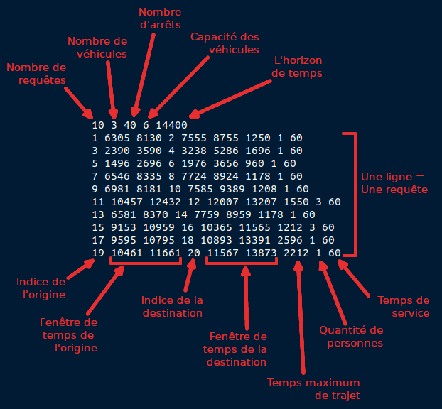
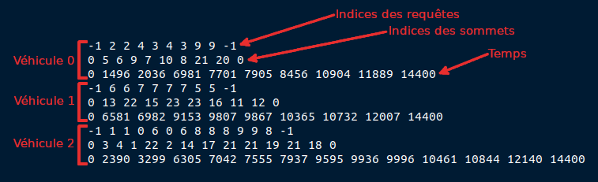

Travail de Jonathan Raffin et Logan Coruble

# Pour tester notre travail:

Il faut exécuter le fichier Main.java.
Ce fichier va lancer une interface pour choisir un fichier à visualiser, soit une instance, soit une solution.
Après avoir sélectionné le fichier, l'animation se lancera automatiquement.

# Organisation des fichiers:

Nous avons utilisé le Modèle MVC.

1) Modèle:

    A) parser: Permet de parser les différents fichiers de données.

    B) animation: Contrôle les différentes animations.
    - IAnimation: interface pour chaque animation.
    - AnimationInstance: Gère l'animation des instances.
    - AnimationSolution: Gère l'animation des solutions
    - AnimationInstanceAndSolution: Gère l'animation des instances et des solutions.
    - Car: Permet de créer un WayPoint "Véhicules" qui va se déplacer sur les trajets.

2) Vue:

    A) gui: Permet d'avoir un interface graphique (l'ensemble de la fenêtre).
    - GUI: Interface graphique.
    - Control: Gère le temps pour le projet et la modification de celui-ci via les boutons de l'interface.

    B) map: Permet de créer une carte, d'afficher des éléments.
    - CustomWaypoint: Créer un Waypoint.
    - CustomWayPointRenderer: Modifie le rendu d'un Waypoint, avec les symboles, les textes ou les couleurs.
    - GeoJsonMapViewer:Affiche une carte, crée le tram, les routes et les waypoint, les voitures, les affiche et les supprime. 
    - MultiplyComposite: Combine deux images. Très utile pour le rendu.
    - RoutePainter: Permet de dessiner une route.

3) Controller:

    - Main: Fichier principale, exécute le projet.
    - ChoixVisualisation: Interface pour choisir le fichier à visualiser: instance, solution ou les deux.
    - Controller: C'est le lien entre le modèle et la vue de ce projet. Permet de lancer une animation.

En +:
- DemoParser: Permet de montrer le fonctionnement de nos parsers.

# Projet visualisation de tournées de véhicules au Havre

Un projet est en cours de réalisation à l'université du Havre sur du transport de passagers par des véhicules à la demande et par les lignes de tram. Le but est d'optimiser le trajet des véhicules à la demande tout en respectant les requêtes des passagers. Une requête consiste en un point de départ, un point d'arrivée et des fenêtres de temps pour le départ et pour l'arrivée. Les utilisateurs peuvent utiliser des véhicules à la demande, et les lignes de tram comme la A et la B, ainsi qu'une troisième ligne de tram qui va être construite.

Pour bien comprendre le comportement des tournées et analyser, il est intéressant de faire une visulisation claire de la solution. 

## Visualisations à faire

L'objectif est de représenter au mieux les données de l'instance et de la solution à travers des animations. Vous êtes libres d'animer comme vous voulez, et de prendre les décisions qui vous semblent le plus judicieuses. Voici deux pistes de réflexion:
- Une visualisation de l'instance uniquement, sans déplacement des requêtes. C'est-à-dire voir en temps réel les requêtes s'afficher selon leurs fenêtres de temps, en sachant quel sommet correspond à l'origine et quel sommet à la destination;
- Une visualisation de la solution. Là beaucoup de choix sont possibles, mais il faudrait au moins le déplacemenent des véhicules et au moins voir quelles requêtes prennent le tram.

## Liste des fichiers
Fichiers commun à toutes les instances:
- `stations.geojson` contient les informations sur les stations, comme les localisations ou les noms
- `matrice_temps_tram.txt` contient une matrice des temps de trajet du tram, ordonnée selon `stations.geojson`
- `reseau_tram.geojson` contient le tracé des trams (en ligne droite pour la ligne C)

Fichiers relatifs à la **i**-ème instance de **v** véhicules avec **r** requêtes. (exemple avec `v=3`, `r=10` et `i=0`)
- `i3_10_0.txt` contient les informations sur l'instance;
- `d3_10_0.txt` contient la matrice des temps de trajet;
- `l3_10_0.txt` contient les localisations du dépôt, des origines et destinations;
- `s3_10_0.txt` contient la solution de l'instance correpondante.

Fichier optionnel:
- `coastline_LeHavre.geojson` qui contient un tracé de la côte, que vous pouvez inclure dans la visualisation
  
## Fichier de l'instance

Voici le fichier de comment se décompose l'instance:

La capacité est le nombre de personnes que peut prendre le véhicule. L'horizon de temps (en secondes) est le temps dans lequel des requêtes peuvent être générées. Dans le fichier solution, on part du principe que le temps commence à 0 et finit à l'horizon de temps. À vous de voir si vous voulez afficher le temps, et comment ! Par secondes, minutes, heures, commencer à 0 ou à 8h pour un peu plus de réalisme.

Les indices pour les orginies destinations sont pour la matrice des temps de trajet, mais aussi pour le fichier `l3_10_0.txt`. Les fenêtres de temps représentent le moment où la requête peut être prise ou déposée. Le temps de trajet maximum ne vous sera pas utile je pense. La quantité est le nombre de personnes qui souhaitent se déplacer et le temps de service est le temps de rentrer ou sortir du véhicule. Donc si un véhicule arrive au temps **x**, et que le temps de service et **y**, le véhicule partira au plus tôt à **x+y**.

## La matrice des temps de trajet
Tous les temps des temps de trajet sont indiqués sur la matrice, qui se décompose de la manière suivante:

<table>
    <tbody>
        <tr>
            <td> OD-OD </td>
            <td>OD-arrêt</td>
        </tr>
        <tr>
            <td>OD-arrêt</td>
            <td>arrêt-arrêt</td>
        </tr>
    </tbody>
</table>

OD correspond au dépôt avec les origines destinations, avec les indices correspondants au fichier de l'instance. Pour obtenir les indices coorespondants à `stations.geojson` pour les arrêts, il faut soustraire par la taille de OD. Les arrêts apparraissent dans le même ordre, mais décalés. La matrice est symétrique.

## Fichier de la solution

Le fichier solution décrit les routes. Un bloc de 3 lignes forme une route. Les trois lignes ont pour taille le nombre de sommets visités. La première ligne, les indices des requêtes, indiquent quelle requête est prise ou déposée à ce moment. -1 indique le dépôt, il n'y a donc pas d'action sur les requêtes. La seconde ligne est pour la localisation, qui indique les sommets sur la carte. Les indices correspondent à la matrice des temps de trajet. La dernière ligne correspond au temps, qui est l'arrivée du véhicule sur le sommet. 

## Pour finir

Je suis totalement disponible pour faire des réunions, si quelque chose ne vous semble pas clair, que vous avez des questions, ou seulement discuter de la meilleure façon de faire. Mon mail: louise.penz@univ-lehavre.fr

À vous de jouer ! ᕙ(ȌగŐ)ᕗ

